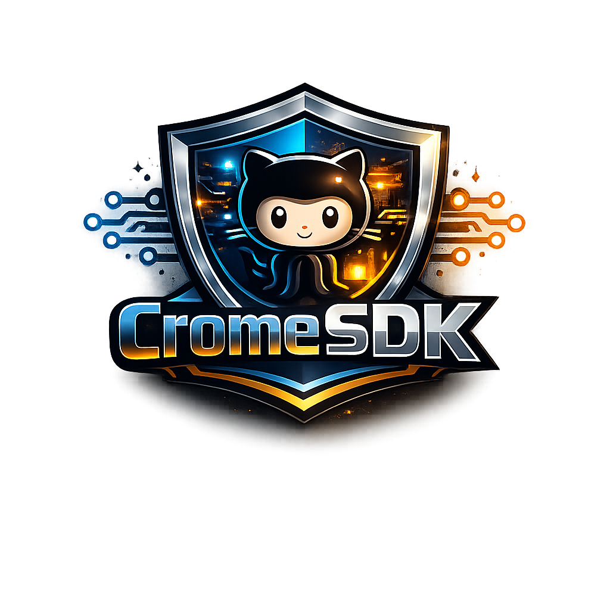

# Python

## @cromesdk/template-generator

template-generator is a high-performance CLI utility designed to automate the process of project scaffolding and boilerplate generation. By leveraging the power of **Jinja2** templates and JSON-based configuration, it allows developers to define complex file structures and render them dynamically with precision. Whether you are bootstrapping a new microservice or generating repetitive library components, this tool ensures consistency and saves significant manual effort.

# Typescript

## @cromesdk/encryption

A high-performance, developer-focused encryption module for NestJS applications. This library provides a seamless wrapper around bcryptjs, offering ready-to-use services for secure secret hashing and verification with full TypeScript support and integrated environment configuration.

## @cromesdk/environment

A high-performance NestJS utility designed to manage environment configurations with strict runtime validation. Built with TypeScript, it provides a globalized service and utility suite for automated .env management and typed access to critical application variables.

## @cromesdk/logger

A high-performance, Winston-backed logging module for NestJS applications. This project provides a production-ready logging infrastructure that integrates seamlessly with the NestJS dependency injection system, offering structured JSON logging for cloud environments and colorized console output for local development.

## @cromesdk/rbac-backend-template

A high-performance enterprise backend architecture built with Node.js, NestJS, and Prisma. This project implements a sophisticated Role-Based Access Control (RBAC) system featuring granular permissions, group-role hierarchies, and automated database orchestration using SQLite.

## @cromesdk/swagger

An enterprise-grade utility module for NestJS that streamlines the integration and management of OpenAPI (Swagger) documentation. It utilizes an environment-driven approach via the NestJS ConfigService to dynamically mount and configure the Swagger UI with minimal code intervention.

## @cromesdk/template

Developing high-quality TypeScript libraries requires more than just code; it requires a robust ecosystem of tooling for bundling, testing, and documentation. This project provides a professional-grade boilerplate designed for developers who want to build, test, and ship modern Node.js packages with zero friction.

